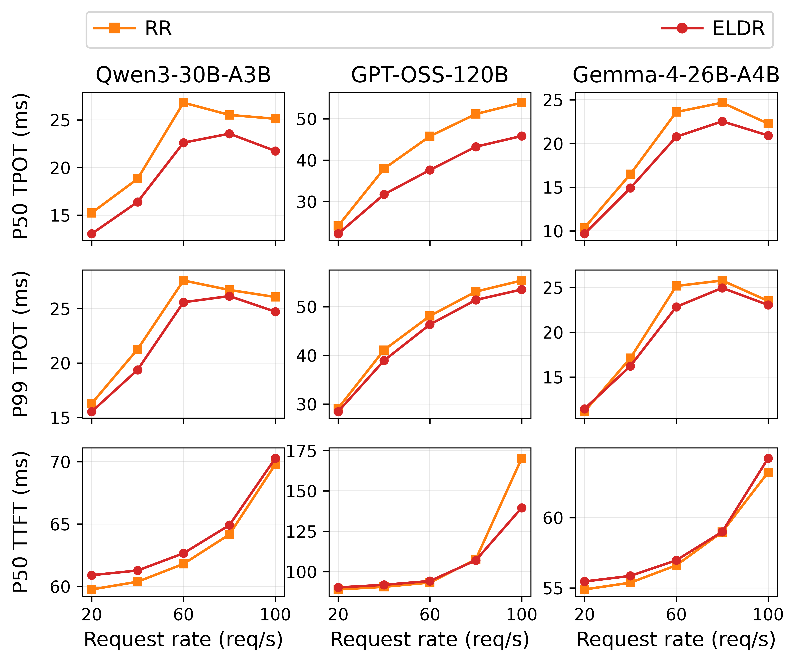
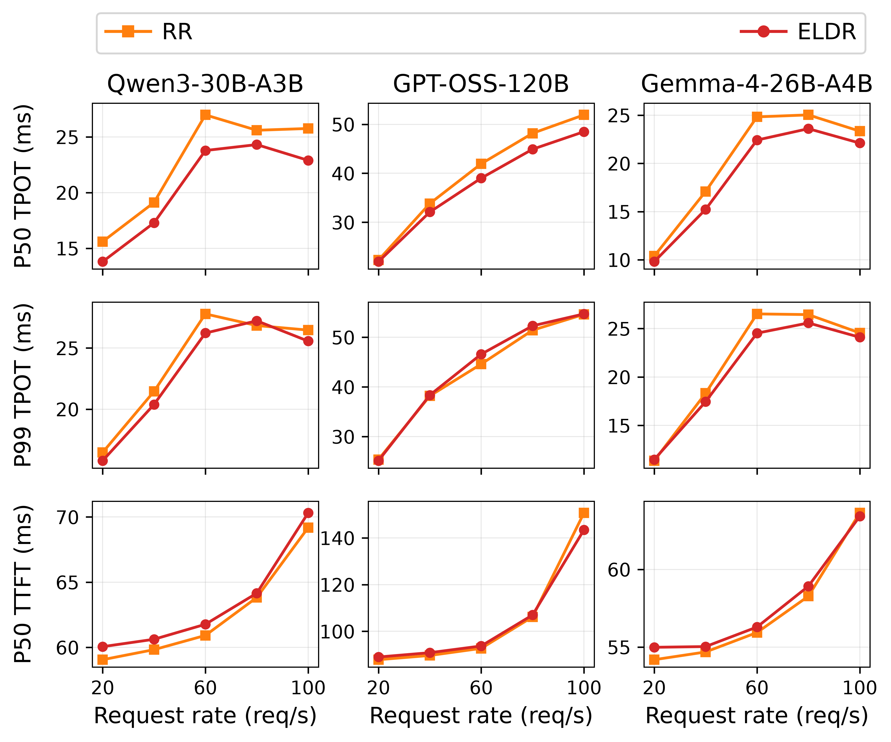

# Main Task and Language: online ELDR, 2026-10-09

Fresh RR versus online ELDR measurements from `run-2cpu-rr-eldr`.
Both policies use two proxy CPU cores on the same 8P16D deployment.
ELDR uses counts × IDF, the calibrated layer mask, L2 normalization, and
locality-band JSQ (tau = 0.1), with a 5-second history and 1-second refit interval.

Each figure contains all three models at 20, 40, 60, 80, and 100 requests/s.
Rows show TPOT P50, TPOT P99, and TTFT P50 in milliseconds.
There is one measurement per policy/model/rate, with 512 output tokens per
request. No measurements from earlier runs or other baselines are merged.
The CSV files also include TPOT P95 and the source raw-file SHA-256 hashes.

These are result previews; the paper and the AE main branch are unchanged.

## Task

[PDF](main_task.pdf) · [CSV](main_task.csv)

## Language

[PDF](main_language.pdf) · [CSV](main_language.csv)

